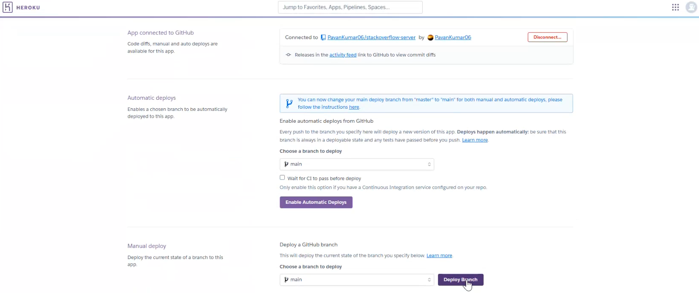
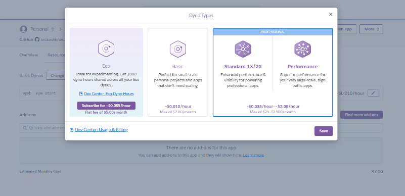

# Steps to Set Up Heroku Deployment for Your Backend Service

## Step 1: Enroll in GitHub Student Developer Pack and Heroku for Students

1. **Enroll in GitHub Student Developer Pack**
   * Visit GitHub Education and select **"Get student benefits"**. Follow the instructions to apply. Approval can take up to 2 business days.

2. **Set Up Heroku for Students**
   * Go to Heroku.com and create an account (use the same email as your GitHub account).
   * Enroll in the Heroku for Students offer, which requires the GitHub Student Developer Pack.
      * **Note**: You'll need to add a credit card for the platform credits that Heroku provides for student use.
   * After approval, you should see these credits in the billing section of your Heroku account within a few hours. **Wait to create an app until credits are available.**

## Step 2: Create a New Application on Heroku

1. **Navigate to the Heroku Dashboard**
   * After logging into Heroku, go to your Dashboard.

2. **Create a New App**
   * Select **New -> Create New App**.
   * Choose a descriptive app name (this will form part of your app's URL).
   * Click **Create App** to proceed.

   

## Step 3: Deploy the Server from a New Repository

1. **Create a New Repository**
   * You must create a new Repository on Github which will contain only your server code.
   * Crate a new Repository on Github and copy paste your server folder.
   * Copy the .gitignore from the root of the original repository to the server repository.

2. **Update Yaml file**
   * Once the client and server folders are separated into different repositories, update the .github\workflows\main.yml in each as the following:

   # Server - GitHub Actions CI Workflow Configuration

      ```yaml
      name: FakeStackOverflow CI
      on: # Controls when the action will run.
      # Triggers the workflow on push or pull request events but only for the master branch. If you want to trigger the action on other branches, add here
      push:
         branches: [main]
      pull_request:
         branches: [main]

      # Allows you to run this workflow manually from the Actions tab
      workflow_dispatch:

      # A workflow run is made up of one or more jobs that can run sequentially or in parallel
      jobs:
      build-and-test: #
         # The type of runner that the job will run on
         runs-on: ubuntu-20.04

         # Steps represent a sequence of tasks that will be executed as part of the job
         steps:
            - name: Git Checkout
            uses: actions/checkout@v4

            - name: Set up Node.js 20.x
            uses: actions/setup-node@v4
            with:
               node-version: "20.x"

            - name: Launch MongoDB Server
            uses: supercharge/mongodb-github-action@1.11.0
            with:
               mongodb-version: "7.0"

            - name: Build and lint frontend
            if: ${{ always() }}
            env:
               REACT_APP_SERVER_URL: http://localhost:8000
            run: cd client; npm ci && npm run build && npm run lint
      ```
   
   # Client - GitHub Actions CI Workflow Configuration

      ```yaml
      name: FakeStackOverflow CI
      on: # Controls when the action will run.
      # Triggers the workflow on push or pull request events but only for the master branch. If you want to trigger the action on other branches, add here
      push:
         branches: [main]
      pull_request:
         branches: [main]

      # Allows you to run this workflow manually from the Actions tab
      workflow_dispatch:

      # A workflow run is made up of one or more jobs that can run sequentially or in parallel
      jobs:
      build-and-test: #
         # The type of runner that the job will run on
         runs-on: ubuntu-20.04

         # Steps represent a sequence of tasks that will be executed as part of the job
         steps:
            - name: Git Checkout
            uses: actions/checkout@v4

            - name: Set up Node.js 20.x
            uses: actions/setup-node@v4
            with:
               node-version: "20.x"

            - name: Launch MongoDB Server
            uses: supercharge/mongodb-github-action@1.11.0
            with:
               mongodb-version: "7.0"

            - name: Build backend service
            if: ${{ always() }}
            run: cd server; npm ci

            - name: Test backend server
            if: ${{ always() }}
            env:
               # Pass the environmental variables for the backend tests to use
               MONGODB_URI: mongodb://localhost:27017
            run: |
               cd server

               npm run start & sleep 10

               echo "Checking if the server is running..."
               curl --fail 'http://localhost:8000/question/getQuestion?order=newest&search=' || (echo "Server failed to start" && killall node && exit 1)

               echo "Server started successfully. Now stopping..."
               killall node

               npm run test

            - name: Lint backend
            if: ${{ always() }}
            run: cd server; npm run lint
      ```

## Step 4: Connect to GitHub for Continuous Deployment

1. **Connect to GitHub Repository**
   * In your Heroku app dashboard, scroll to the **Deployment method** section and select **GitHub**.
   * Click **Connect to GitHub** and search for your repository.
   * Select the repository containing your backend service code.

   

2. **Configure Required Files**
   * You need to make these changes to the package.json
     * Move "dotenv" from the "devDependecies" to "dependencies".
     * Change the "start" script in your server/package.json from "ts-node server.ts" to "node dist/server.js".
     * Add a new script called "start:dev" with the value "ts-node server.ts". You can use this for your local development.
   * The package.json file should look something like this:
     * [`package.json`](assets/heroku-deployment/package.json) - Contains required dependencies and scripts

   * You need to make these changes to the tsconfig.json
     * Go to server/tsconfig.json and scroll to the end. Modify the "include" and "exclude" values, as specified in the tsconfig.json:
     ```json
      "include": ["./**/*.ts"],
      "exclude": ["node_modules", "dist"]
     ```
   * The tsconfig.json file should look something like this:
     * [`tsconfig.json`](assets/heroku-deployment/tsconfig.json) - TypeScript configuration

## Step 4: Deploy the Code

1. **Manual Deployment**
   * Configure the Manual deploy option in Heroku. Everytime you push a change to your main branch, you will have to login to Heroku and click on the Deploy Branch button.
   * In Heroku, scroll to the **Manual deploy** section.
   * Choose the main (or preferred deployment) branch.
   * Click **Deploy Branch** to deploy your application manually.

    

2. **Automatic Deployment Option**
   * Configure the Automatic deploy option in Heroku. Everytime you push a change to your main branch, Heroku will automatically publish your changes.
   * In Heroku, scroll to the **Automatic deploys** section.
   * Choose the main (or preferred deployment) branch.
   * Click **Enable Automatic Deploys** to deploy your application automatically.

## Step 5: Environment Variables

1. **Set Up Environment Variables**
   * In your Heroku dashboard, go to **Settings -> Config Vars**
   * Add your MongoDB connection string as a config var:
     ```
     Key: MONGODB_URI
     Value: <your MongoDB connection string>

     Key: PORT
     Value: 8000
     ```
   * Make sure your MongoDB connection matches the URI in your Mongo Cloud.
   * Another option is to add the .env file to your server repository.

## Step 6: Update Client Environment Variables on Render.com

Update the server URL from the Render.com URL to the Heroku URL.

1. **Open the Render Dashboard.**
2. Choose the project you have created and go back to the service with type "Static Site" (your client deployment).
3. Click on the **Environment** tab.
4. Change the value of the `REACT_APP_SERVER_URL` environment variable to the Heroku URL (you can find this in your Heroku app's **Settings** page, under the **Domains** section).
5. After the client finishes re-deploying, check if the client is sending queries to the new Heroku server deployment successfully.
6. *(Optional)* If the new Heroku server deployment is working correctly, delete the server deployment from Render.

## Step 7: Update Dyno Type for Memory Issues

In case you are still running into memory issues in the Heroku deployment, you can update the "Dynos" type.

1. Follow the steps from [Heroku Help - Change Dyno Types](https://help.heroku.com/XX3MKY2E/how-do-i-change-the-dyno-types-for-my-application) to adjust the dyno type for your application.
2. **Choose the type carefully** as selecting a higher type will result in a higher cost, which will reduce your Platform Credits.



